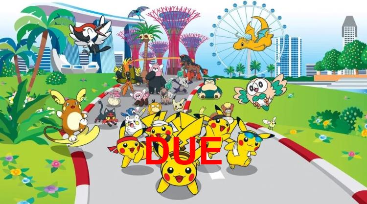

# H6751 Web and Text Mining

#### 
NTU, WKW / Spring 2020

## Course Description 

Nowadays, with the popularity of the Internet, there is a massive amount of text content available on the Web, and it becomes an important resource for mining useful knowledge. From a business and government point of view, there is an increasing need to interpret and act upon the large-volume text information. Therefore, text mining (or text analytics) is getting more attention to analyze text content on the Web. For instance, opinion mining and sentiment analysis is one of text mining techniques to analyze user-generated content on social media platforms.

This course is an introduction to text and web mining. It covers how to analyse unstructured data (i.e. text content) on the Web using text mining techniques. Students will learn various text mining techniques and tools both through lectures and hands-on exercises in labs. The course will also explore various usages of text mining techniques to real world applications. This course focuses on Web content mining, but not on Web structure and usage mining.

Students will learn following topics in the course:

* Principles and concepts of text and web mining.
* Various text mining techniques: Pre-processing for Text Mining, Text Categorization, Document Clustering, Information Extraction, and Opinion Mining & Sentiment Analysis.
* Practical use of text mining to real world applications, such as Text Message Spam Detection,
and Sentiment Analysis Systems analyzing public opinion towards various subjects, such as electronic gadgets, movies, stocks, etc., using social media content.

### Contact Information:

- Lecturers: 
     * [Zhao Rui](https://rzntu.github.io), [rui.zhao@ntu.edu.sg](mailto:rui.zhao@ntu.edu.sg)

     * [Chen Zhenghua](https://zhenghuantu.github.io), [zhenghua.chen@ntu.edu.sg](mailto:zhenghua.chen@ntu.edu.sg)
            
### Course Objectives:

At the end of this course, students should be able to:

- Appreciate the basics of text and web mining.
- Understand the advantages and disadvantages of different text mining techniques.
- Work on practical problems that can be solved using text mining techniques.

### Prerequisites:

- The student has some aptitude for low-level logical thinking since lectures and labs will focus
on technical aspects of Text and Web Mining.
- Basic knowledge in **Python programing**.

### Reference Books

The following books are helpful, but not required. You will easily get these books from Internet.

- Foundations of Statistical Natural Language Processing *Christopher D. Manning and Hinrich Schütze*
- Neural Network Methods for Natural Language Processing *Yoav Goldberg*
- Introduction to Computation and Programming Using Python : With Application to Understanding Data *John V. Guttag* 
- Applied Text Analysis with Python *Benjamin Bengfort* 

If you are not proficient in python, you may find [some tutorials](material/coding.md) helpful.

### Course material and links

- [Timetable](#schedule)
- [Syllabus](material/syllabus.md)
- [Data Science/Machine Learning](material/dspractice.md)
- [Final project](project/project.md)
- [IVLE](https://ivle.nus.edu.sg/); used to submit your assignments (via workbin) and send important emails; **please check that you are enrolled.**
- [Honor Code](honorcode.md)

## Announcement

> - *2020-01-17*: Welcome to BT5153. We hope you will enjoy it!
> - *2019-12-01*: ~~this site has been public.~~

## Assessment

### Individual Assignments (10%)

These are individual homework and lab assignments. For the lab assignments, you will be asked to submit simple lab reports during or after certain lab sessions. Note that homework and lab assignment reports handed in after the due date/time will not be marked. These assignments will account for 10% of the overall grade. Details of the individual assignment will be announced later. 

### Group Project (30%)

You are required to form a project group with 4-5 members. Your project task is to apply the data mining and machine learning techniques that you have acquired to gain insights and draw interesting conclusions to a (business) problem. You are to apply (advanced) data mining and analytics tools (preferably in Python as Python tools are used as supplementary aids during the delivery of this course) to process structured and unstructured data available on the Web. You will then summarize your insights and present your conclusions using suitable visual aids. More detailed information can be found [here](project/project.md).

- **Credit**:
  * Project report (15%) 
  * Project presentation (15%)

## Schedule

Class Venue: LT 15

**Date** |	**Topic** |	**Lecture** | **Assignment Due**
:----:  | ------- | :----: | ---------------
Sat a.m 01/18 | Introduction to Text Mining | TBU | N.A.
Sat a.m 02/01 | Web Scraping | TBU | Form your team
Sat p.m 02/01 | Pre-processing for Text Mining I  | TBU | N.A.
Sat a.m 02/15 | Pre-processing for Text Mining II | TBU | N.A.
Sat p.m 02/15 | Information Extraction |TBU | Group Project Proposal
Sat a.m 02/29 | Text Categorization I| TBU | Individual Assignment 1
Sat p.m 02/29 | Text Categorization II| N.A. | N.A.
Sat a.m 03/21 | Document Clustering | TBU | In-class Midterm Exam
Sat p.m 03/21 | Sentiment Analysis | TBU | N.A.
Sat a.m 04/04 | Neural Network | TBU | Kaggle Competition Ends
Sat p.m 04/04 | Word Embeddings | TBU| N.A.
Sat a.m 04/18 | CNN and RNN | N.A. | N.A.
Sat p.m 04/18 | Group Presentation | N.A. | N.A.

    
## Enjoy the class and all the deadlines

